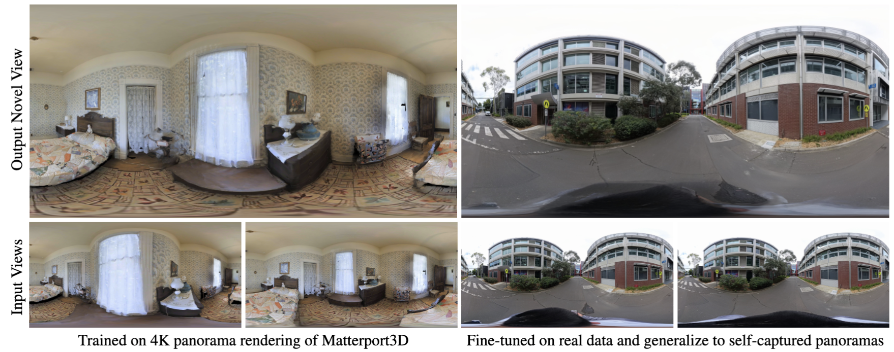
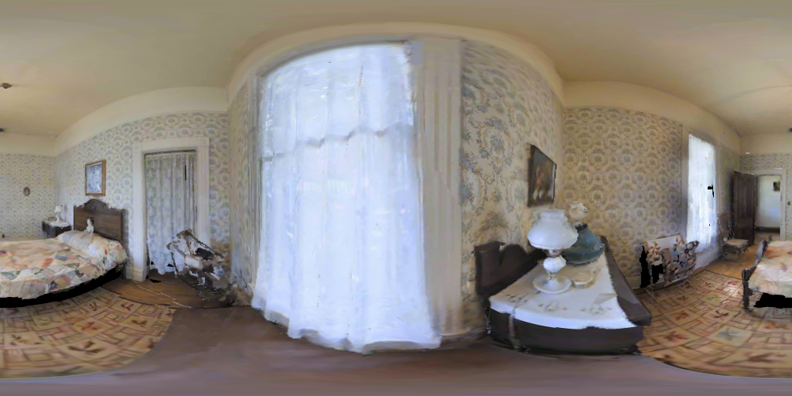
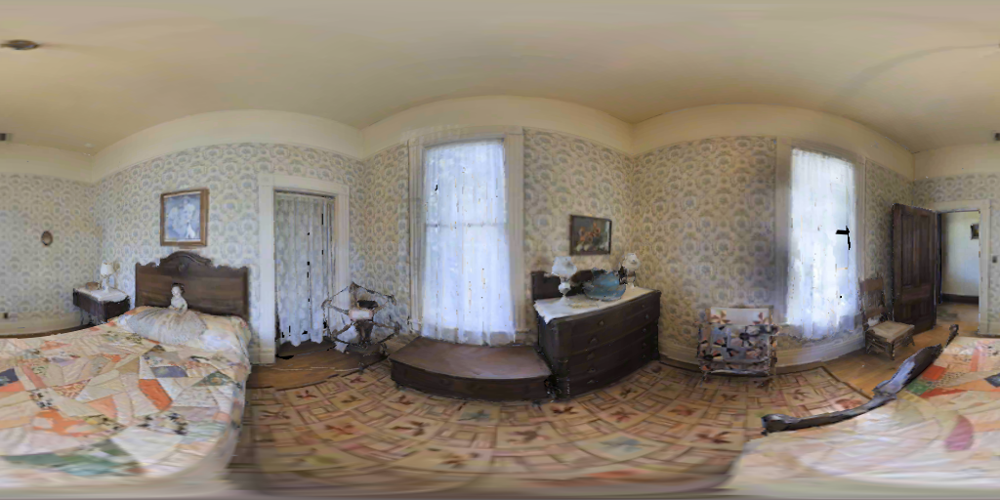

# PanSplat

### PanSplat: 4K Panorama Synthesis with Feed-Forward Gaussian Splatting
Cheng Zhang, Haofei Xu, Qianyi Wu, Camilo Cruz Gambardella, Dinh Phung, Jianfei Cai

### [Project Page](https://chengzhag.github.io/publication/pansplat) | [Paper](http://arxiv.org/abs/2412.12096)



## Introduction

This repo contains training, testing, evaluation code of our arXiv 2024 paper.

## Installation

We use Anaconda to manage the environment. You can create the environment by running the following command:

```bash
conda create -n pansplat python=3.10
conda activate pansplat
pip install torch==2.4.0+cu118 torchvision==0.19.0+cu118 torchaudio==2.4.0+cu118 --index-url https://download.pytorch.org/whl/cu118
pip install -r requirements.txt
pip install git+https://github.com/dcharatan/diff-gaussian-rasterization-modified
pip3 install -U xformers==0.0.27.post2+cu118 --index-url https://download.pytorch.org/whl/cu118
```

We use wandb to log and visualize the training process. You can create an account then login to wandb by running the following command:
```bash
wandb login
```

## Demo

You can download the pretrained checkpoints [last.ckpt](https://monashuni-my.sharepoint.com/:u:/g/personal/cheng_zhang_monash_edu/EUSd23tEyjpIg-A6YMdrV-gBMSHG9hLk5zYC_Aq80csDig?e=0gMnFr) (trained on the Matterport3D dataset at 512 × 1024 resolution) and put it in the `logs/nvpl49ge/checkpoints` folder. Then run the following command to test the model:
    
```bash
python -m src.paper.demo +experiment=pansplat-512 ++model.weights_path=logs/nvpl49ge/checkpoints/last.ckpt mode=predict
```

The code will use the sample images in the `datasets/pano_grf` folder:

 

The output will be saved in the folder with the format `outputs/2025-01-13/16-56-04`:


Additionally, we provide a fine-tuned checkpoint [last.ckpt](https://monashuni-my.sharepoint.com/:u:/g/personal/cheng_zhang_monash_edu/Ee1xYAdyL3xOoGZdyMi4fPMBnq5n-XXQmGZvSrirAhrjGA?e=mU2pAR) (fine-tuned on the Matterport3D dataset at 2048 × 4096 resolution) for 4K panorama synthesis. You can put it in the `logs/hxlad5nq/checkpoints` folder and run the following command to test the model:

```bash
python -m src.paper.demo +experiment=pansplat-2048 ++model.weights_path=logs/hxlad5nq/checkpoints/last.ckpt mode=predict
```

This requires a GPU with at least 24GB of memory, e.g., NVIDIA RTX 3090.

## Citation

If you find our work helpful, please consider citing:

```bibtex
@misc{zhang2024pansplat4kpanoramasynthesis,
      title={PanSplat: 4K Panorama Synthesis with Feed-Forward Gaussian Splatting}, 
      author={Cheng Zhang and Haofei Xu and Qianyi Wu and Camilo Cruz Gambardella and Dinh Phung and Jianfei Cai},
      year={2024},
      eprint={2412.12096},
      archivePrefix={arXiv},
      primaryClass={cs.CV},
      url={https://arxiv.org/abs/2412.12096}, 
}
```
